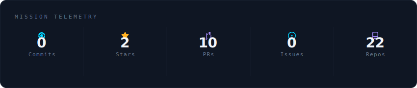

  

 

  

 

  

 

  

## Features

- **Spiral Galaxy Header** — animated galaxy with spiral arms, shooting stars, and a glowing core displaying your name and tagline
- **Mission Telemetry** — real-time GitHub stats (commits, stars, PRs, issues, repos) fetched via GraphQL or REST fallback
- **Language Telemetry + Focus Sectors** — language usage bars and a rotating radar chart of your focus areas
- **Featured Systems** — project cards with orbital animations and constellation connections
- **Fully Configurable** — colors, focus areas, projects, and displayed metrics are all controlled via `config.yml`
- **Auto-Updates** — GitHub Actions regenerates SVGs every 12 hours or on config changes

